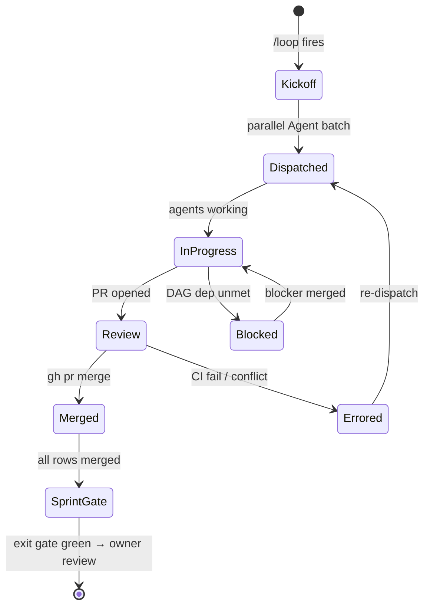

# Control One — PR #51 Closure Timeline

**Status:** delivery plan
**Date:** 2026-05-08
**Source PR:** [#51](https://github.com/CloudSpaceLab/control_one/pull/51)
**Companion docs:** [`gaps-vs-probo-holmesgpt.md`](./gaps-vs-probo-holmesgpt.md), [`incomplete-features-and-bugs.md`](./incomplete-features-and-bugs.md)
**Target tag:** v1.1.0-pilot
**Start date:** 2026-05-11
**Projected end:** 2026-09-04

PR #51 shipped two strategic docs anchored to the owner's three-pillar lens but no delivery plan: no calendar, no worktree breakdown, no dependency graph, no projected tag. This document is the plan. Scope: full **P0 + P1 + P1.5 + P2 + P3** (~15 working weeks), modeled as parallel worktrees per sprint, executed via a `/loop`-driven coordinator that dispatches per-worktree subagents across **three Claude tiers (Opus 4.7 / Sonnet 4.6 / Haiku 4.5) and three frontier providers (Anthropic, OpenAI, Google)** behind a unified Go router introduced in Sprint 5.

**P1.5 (Sprint 6) is the investigation event-capture layer** — without it, the MCP/`tool_use` surface from S5 can reason but the evidence base is shallow. Concrete target: when "server disk space starts depreciating fast because a log is accumulating MBs fast" happens in production, the investigation surface should be able to answer, in one chat turn, the full timeline — connection-rate doubling on port 80 (15→30 cps), 2 TB transferred in the spike window, CPU 20→99%, memory 60→99%, three log files growing 30 MB → 13 GB, the app/db log lines that explain the cause — and (when safe gates pass) auto-de-escalate via smart log truncation or rogue-connection/process kill before the host locks out.

Predecessor work (Sprints 0–3, v1.0.0) is closed. This is **Sprint 4 onward**.

---

## 0. The lens (carried from the gap doc)

> "In a bank, daily ops are mostly boring. Only three things ever change — **traffic surge, incoming attacks, server health depreciation**. When investigation is needed, give complete detail to any depth via a chat-first interface. UI refactor is separate."

Every worktree below carries a pillar tag (🚦 / 🛡️ / 💚 / 🔬 / 🏛️) so the plan stays anchored to the lens, not to a feature taxonomy.

---

## 1. 3-Pillar status (post-Sprint-3)

### 🚦 Surge

| ✅ Shipped | ❌ Remaining |
|---|---|
| `telemetry_metrics_1m` + `unique_counters` collected | No surge-specific detector (z-score on rolling 1m/5m/1h windows) |
| | No Prometheus / Alertmanager ingest |

### 🛡️ Attacks

| ✅ Shipped | ❌ Remaining |
|---|---|
| 7 inline behavioral detectors | Zero CVE / KEV / NVD / OSV references |
| 7 TI feeds + correlation engine | Trivy adapter discards CVE detail |
| Auto-block firewall fan-out | Findings overlay (Probo cherry-pick) |
| | AML auth gap (P0 security) |
| | Sanctions HTTPS + DOB fallback (P0 security) |

### 💚 Health

| ✅ Shipped | ❌ Remaining |
|---|---|
| Heartbeat + disk + node_repair | "Calibrating (0/24)" stuck — agent emits 9 names, predictive engine reads 7 disjoint names |
| `node_health_scores` table | No SMART / PSI / HSM collectors |
| | No predictive trend regression |

### 🔬 Investigation

| ✅ Shipped | ❌ Remaining |
|---|---|
| 10+ REST investigation endpoints | Single-shot LLM at `controlplane/internal/server/ai_ask.go:256` — no `tool_use` loop |
| Hand-rolled markdown KG | KG ~15% of what its intro claims (no firewall, alerts, health, baselines, Doris reads) |
| | KG-A is dumped whole into every `/ai/ask` system prompt (S4 `c1-kg-compress` adds dedup + keyword-prune as the bridge to S7 KG-B; see §11 D5) |
| | OpenReplay session recording is a no-op stub |
| | **No per-port flow-rate tracking (cps deltas)** — `process_connections` has rows but no rolling-window aggregate |
| | **No file-system growth tracking** — agent doesn't watch log dirs; can't say "this log grew 13 GB in 8m" |
| | **No log-tail tool** — LLM can't read app/db log lines to diagnose root cause |
| | **No resource-delta tool** — LLM can ask for a metric value but not "value at T0 vs T1" |
| | **No root-cause synthesizer** — anomaly emit + dimensions + log tails never collapsed into one verdict row |
| | **No auto-de-escalation action layer** — smart log truncation, rogue-conn kill, rogue-process kill |

---

## 2. Sprint plan — parallel worktrees

| Sprint | Tier | Wall time | Worktrees | Goal |
|---|---|---|---:|---|
| **Sprint 4** | P0 | ~2 wks | 13 | Block-any-pilot-demo: security + 3 single-node bugs + patch gate + KG-A + UX nav |
| **Sprint 5** | P1 | ~3 wks | 11 | Pilot-signoff: LLM router + MCP/tool_use chain + CVE/KEV + agent reliability + critical test coverage |
| **Sprint 6** | P1.5 | ~2 wks | 7 | **Investigation event-capture:** fs-watcher + flow-rate + bandwidth rollups + delta tool + log-tail + root-cause synth + auto-de-escalate |
| **Sprint 7** | P2 | ~2 wks | 10 | Hardening: KG tool-shaped + Probo cherry-picks + scalability + evidence backend |
| **Sprint 8** | P3 | ~1 wk | 6 | Cleanup: telemetry rough edges + shim removal + production runbook |

**47 worktrees total. Projected v1.1.0-pilot tag: 2026-09-04.**

---

## 3. Loop workflow shape

Each sprint runs as one `/loop` cycle (dynamic pacing). Owner approves the sprint exit gate before the next sprint kicks off — oversight at sprint boundaries, throughput inside the sprint.



**Pacing rules:**
- Active sprint with running PRs: 1500–1800 s ticks (~25–30 min) — stays inside the Anthropic prompt-cache TTL.
- DAG-bottleneck wait (e.g. S5 day-1 MCP wrapper unblocks day-2 tool_use loop): drop to 600–900 s.
- Mid-sprint stall (no PR motion >2 ticks): bump to 3000 s and surface a status note; don't burn cycles polling.

**Status values** in worktree tables below match Mermaid state names verbatim: `dispatched / in-progress / review / merged / blocked / errored`.

The loop coordinator is the main session; subagents do not nest loops. State lives in this document — no separate state file. Each tick the loop reads `gh pr list`, updates status columns, re-dispatches errored agents, dispatches unblocked agents.

### Model dispatch policy

The loop dispatches each worktree to a Claude variant matched to its complexity, not a single default. Three tiers across the available models (Opus 4.7, Sonnet 4.6, Haiku 4.5):

| Tier | Model | When to pick | Cost/latency profile |
|---|---|---|---|
| **L1 — Trivial** | Haiku 4.5 | ≤1 d effort, single-file edit, no architecture decisions, no cross-cutting contracts (e.g. plain text → button, env-var swap, dead-handler delete, JSONB read-through) | Cheapest, fastest. Burns cycles only on what mechanical fixes need. |
| **L2 — Standard** | Sonnet 4.6 | 1–3 d effort, multi-file but bounded scope, follows an existing pattern in the repo (e.g. add a new endpoint matching siblings, a new tab on an existing page, refactor with clear analogue) | Default tier. Most worktrees land here. |
| **L3 — Architectural** | Opus 4.7 | New control flow, agent↔server contract change, security-critical correctness, code with no analogue in the repo (e.g. MCP wrapper, `tool_use` loop in `ai_ask.go`, KG tool-shaped rewrite, calibration metric-name contract spanning agent + predictive engine, CVE/KEV pipeline) | Highest cost, deepest reasoning. Reserved for the rows where wrong-shape changes block the next sprint. |

**Tier appears in every worktree table below as the `Model` column.** Tier counts across the 47 worktrees: **L1 Haiku ×16, L2 Sonnet ×22, L3 Opus ×9**. Owner can override any row before kickoff (e.g. promote a borderline L2 to L3 if the operator-mode trigger is fragile).

**Re-dispatch escalation (two axes):**
- *Tier promotion:* if an L1/L2 row errors twice on CI/lint or hits a structural review comment, the loop promotes one tier on next dispatch. `c1-aml-auth-fix` errored as L1 → next tick redispatch as L2.
- *Provider fallback:* if the primary provider returns 5xx or the agent errors twice, the loop reroutes to the secondary provider (see fallback chain in Multi-provider routing below). Both axes can fire on the same row; tier promotion happens within a provider, fallback happens across providers.

### Multi-provider routing

The dispatch policy spans **three Claude variants AND three frontier providers**, not just Anthropic. Sprint 5 introduces a thin LLM router (`c1-llm-router`, see §5) that wraps three SDKs behind one Go interface; the loop selects provider per-worktree based on the model's known strengths.

**Library pick-list (Go server side):**

```
github.com/anthropics/anthropic-sdk-go    # Claude — default; Opus/Sonnet/Haiku
github.com/openai/openai-go               # GPT family — test-gen, prose, structured extraction
google.golang.org/genai                   # Gemini family — long-context wins
```

**Why three providers, not one:**
1. **Diversity of strengths** — GPT-5 family is stronger at test generation and prose; Gemini 2.5 has 2M-token context that absorbs full KEV/CVE catalogs in one pass.
2. **Redundancy** — an Anthropic API outage on a kickoff morning shouldn't pause the entire sprint; the loop falls back across providers.
3. **Cost shape** — long-context jobs are cheaper on Gemini Flash than Opus 4.7 even at the same quality bar.
4. **Independent benchmarking** — a row that fails twice on one provider auto-redispatches on a second before owner escalation.

**Per-worktree provider overrides** (default is Anthropic; rows below override):

| Worktree | Sprint | Provider + Model | Why |
|---|---|---|---|
| `c1-cve-kev-osv` | S5 | **Google Gemini 2.5 Pro** | Scans full CISA KEV catalog + OSV database + `node_packages`; long-context dominates here |
| `c1-critical-test-coverage` | S5 | **OpenAI GPT-5** | Test generation across 4 untested Go modules — GPT-5 family's strongest documented modality |
| `c1-process-tree-hydrate` | S5 | **OpenAI GPT-5** | Algorithmic recursion over `process_lineage`; well-trodden GPT-5 territory |
| `c1-trivy-cve-detail` | S5 | **OpenAI GPT-5** | Parser/adapter work — structured-data extraction from Trivy JSON output |
| `c1-root-cause-synth` | **S6 (P1.5)** | **Google Gemini 2.5 Pro** | Synthesizes 5 dimension time-series + multi-MB log tails into one verdict — easily exceeds 200 K tokens for a real incident |
| `c1-dashboard-scalability` | S7 | **Google Gemini 2.5 Pro** | Holds whole dashboard query tree + Doris MV definitions in context simultaneously |
| `c1-ingest-version-tolerance` | S7 | **Google Gemini 2.5 Flash** | Wire-format compatibility analysis across agent + controlplane versions |
| `c1-evidence-metadata-jsonb` | S7 | **OpenAI GPT-5-mini** | JSONB schema reconciliation — structured-data work, cost-shaped to mini |
| `c1-rollup-reconciliation` | S8 | **Google Gemini 2.5 Pro** | Cross-system reconciliation — Postgres `IncrementHourlyRollup` vs Doris `events_per_hour_mv` held in one context window |
| `c1-prod-runbook-wiki` | S8 | **OpenAI GPT-5** | Long-form prose writing for on-call audience |

All other 37 rows route to Anthropic per the L1/L2/L3 model column.

**Provider mix across 47 worktrees:** Anthropic ×37 (79%), OpenAI ×5 (11%), Google ×5 (10%).

**Fallback chain:** the router records `{worktree, primary, secondary, tertiary}` per row. If primary errors twice (CI/lint or 5xx from API), the next dispatch routes to secondary; if secondary errors, tertiary. Default chain for Anthropic-default rows is `Anthropic → OpenAI → Google`; Gemini-primary rows fall back `Google → Anthropic → OpenAI`. Owner is paged before the chain exhausts.

---

## 4. Sprint 4 — P0 (block any pilot demo)

**Goal:** ship the four P0 security fixes + three single-node view bugs + patch approval gate + KG minimal enrichment + compliance row→node nav. After S4 the production deployment at `control-one.cloudspacetechs.com` is demo-able.

### Tick table (planned; populated live by `/loop`)

| Tick | Wall time | Pacing | Action | Snapshot |
|---:|---|---|---|---|
| 0 | 2026-05-11 09:00 | — | Dispatch all 13 worktrees as one Agent batch | `13 dispatched / 0 merged` |
| 1 | +1800 s | 30 min | Read `gh pr list`; update worktree table | `13 in-progress / 0 merged` |
| 2 | +1800 s | 30 min | First small-fix PRs land (compliance-row-nav, sanctions-dob, sanctions-https) | `3 merged / 10 in-progress` |
| 3 | +1800 s | 30 min | AML auth + heartbeat-action-prefix + recommendations-bridge land | `6 merged / 7 in-progress` |
| … | … | … | (live) | … |
| N | exit | — | All 13 merged + integration test green + bugs §9 SQL recipes return expected results | `13 merged → SprintGate` |

### Worktrees

| Worktree | Branch | Pillar | Source | Effort | Model | PR | Status | Merge SHA |
|---|---|---|---|---|---|---|---|---|
| `c1-aml-auth-fix` | `fix/c1-s4-aml-auth` | 🛡️ | bugs §4 #1 | 4–6 h | L1 Haiku | — | pending | — |
| `c1-sanctions-https` | `fix/c1-s4-sanctions-https` | 🛡️ | bugs §4 #2 | 2–3 h | L1 Haiku | — | pending | — |
| `c1-sanctions-dob-refuse` | `fix/c1-s4-sanctions-dob` | 🛡️ | bugs §4 #3 | 2 h | L1 Haiku | — | pending | — |
| `c1-openreplay-decision` | `fix/c1-s4-openreplay` | 🏛️ | bugs §4 #4 | 1 h–1 d | L1 Haiku | — | pending | — |
| `c1-recommendations-bridge` | `fix/c1-s4-recos-bridge` | 💚 | bugs §1.3 | 1 d | L2 Sonnet | — | pending | — |
| `c1-calibration-metric-contract` | `fix/c1-s4-calibration` | 💚 | bugs §1.1 | 2–3 d | **L3 Opus** | — | pending | — |
| `c1-connections-doublefilter` | `fix/c1-s4-connections` | 💚 | bugs §1.2 | 1 d | L2 Sonnet | — | pending | — |
| `c1-patch-approval-gate` | `fix/c1-s4-patch-gate` | 🛡️ | bugs §3.1 | 4–6 h or 2–3 d | L2 Sonnet | — | pending | — |
| `c1-patch-node-selector` | `fix/c1-s4-patch-selector` | 🛡️ | bugs §3.3 #2 | 4–6 h | L2 Sonnet | — | pending | — |
| `c1-packages-on-node-tab` | `fix/c1-s4-packages-tab` | 🛡️ | bugs §3.3 #3 | 6–8 h | L2 Sonnet | — | pending | — |
| `c1-heartbeat-action-prefix` | `fix/c1-s4-hb-prefix` | 🛡️ | bugs §3.3 #5 | 2–3 h | L1 Haiku | — | pending | — |
| `c1-kg-compress` | `fix/c1-s4-kg-compress` | 🔬 | bugs §2 option A + §11 D5 | 3 d | **L3 Opus** | — | pending | — |
| `c1-compliance-row-nav` | `fix/c1-s4-compliance-nav` | 🔬 | bugs §1.5 | 30 min | L1 Haiku | — | pending | — |

**S4 tier mix:** L1 ×6 / L2 ×5 / L3 ×2. Calibration + KG-compress carry the Opus seats — both are cross-cutting (agent↔server metric-name contract / `/ai/ask` context shape) where wrong-shape merges block S5 (calibration → operator-mode) and S7 (KG-compress → KG-B) respectively.

### Hard-gate DAG (intra-sprint)

```
c1-recommendations-bridge ─┐
c1-calibration-metric ─────┼─→ c1-kg-compress
                           │   (compression reads node_health_scores +
                           │    port_observations to render outliers;
                           │    both empty until these merge.
                           │    Successor: produces compressed system block
                           │    consumed by S5 c1-tooluse-loop, leaving
                           │    headroom for tool turns.)
c1-patch-approval-gate ───────→ c1-patch-node-selector
                                (no point in better UI if every deploy is gate_blocked)
c1-aml-auth-fix ──────────────→ unblocks "demo to bank" (informational, not code)
```

All other rows are independent — parallel-safe.

### Per-worktree exit criteria

1. `cd controlplane && go test ./... -count=1 -short` green
2. `cd controlplane/ui && npm run lint && npm test` green
3. `golangci-lint run ./...` clean (or matches pre-existing baseline)
4. Migration up/down tested via testcontainers (only if migration touched)
5. One golden-path integration test for the feature
6. PR opened, CI green, links back to this document

### Sprint exit gate

- All 13 worktrees merged, sprint integration test green on production-like Doris+Postgres
- Bugs doc §9 diagnostic SQL recipes on production return expected results:
  - calibration: predictive metric names appear in `telemetry_metrics`
  - connections: `process_connections` rows visible with active flow filter
  - recommendations: `port_observations` row count > 0
  - KG compression: synthetic 1000-node tenant `POST /ai/ask` returns compressed context ≤ 8K tokens (logged length stays under budget); UUID/IP exact-match always present in the system block
- Owner ack received before S5 kickoff

---

## 5. Sprint 5 — P1 (before pilot signoff)

**Goal:** the 5-day MCP/`tool_use` chain (gap doc §6) + CVE/KEV enrichment + agent reliability + process-tree hydration + critical test coverage. After S5, investigation parity with HolmesGPT for relevant scope is real, not aspirational.

### Tick table (planned)

| Tick | Wall time | Pacing | Action | Snapshot |
|---:|---|---|---|---|
| 0 | 2026-05-25 09:00 | — | Dispatch 5 parallel non-MCP worktrees + open MCP day-1 sub-agent | `6 dispatched / 0 merged` |
| 1 | +1800 s | 30 min | MCP day-1 (`c1-mcp-wrapper`) PR opens | `6 in-progress` |
| 2 | +900 s | 15 min (DAG watch) | MCP day-1 merges → dispatch `c1-tooluse-loop` | `1 merged / 6 in-progress` |
| 3..7 | per day | 30 min cadence between MCP days | Day-2 → day-3 → day-4 → day-5 chain merges sequentially | (chain) |
| … | … | … | CVE/KEV + agent-fatal + process-tree + tests land in parallel | … |
| N | exit | — | All 10 merged + Operator-mode auto-investigates a real anomaly emit | `10 merged → SprintGate` |

### Worktrees

| Worktree | Branch | Pillar | Source | Effort | Model | PR | Status | Merge SHA |
|---|---|---|---|---|---|---|---|---|
| `c1-llm-router` | `feat/c1-s5-llm-router` | 🔬 | new (multi-provider) | 1 d | **L3 Opus** | — | pending | — |
| `c1-mcp-wrapper` | `feat/c1-s5-mcp-wrapper` | 🔬 | gap §6 day 1 | 1 d | **L3 Opus** | — | pending | — |
| `c1-tooluse-loop` | `feat/c1-s5-tooluse-loop` | 🔬 | gap §6 day 2 | 1 d | **L3 Opus** | — | pending | — |
| `c1-streaming-citations` | `feat/c1-s5-stream-cite` | 🔬 | gap §6 day 3 | 1 d | L2 Sonnet | — | pending | — |
| `c1-tool-rbac` | `feat/c1-s5-tool-rbac` | 🔬 | gap §6 day 4 | 1 d | L2 Sonnet | — | pending | — |
| `c1-operator-mode` | `feat/c1-s5-operator-mode` | 🛡️🚦💚 | gap §6 day 5 | 1 d | L2 Sonnet | — | pending | — |
| `c1-cve-kev-osv` | `feat/c1-s5-cve-kev` | 🛡️ | gap §5 Attacks | ~13 d | **L3 Opus** | — | pending | — |
| `c1-agent-fatal-cleanup` | `fix/c1-s5-agent-fatal` | 💚 | bugs §5 #5 | 3 d | L2 Sonnet | — | pending | — |
| `c1-process-tree-hydrate` | `fix/c1-s5-process-tree` | 🔬 | bugs §5 #6 | 2 d | L2 Sonnet | — | pending | — |
| `c1-critical-test-coverage` | `test/c1-s5-coverage` | 🏛️ | bugs §5 #9 | 4 d | L2 Sonnet | — | pending | — |
| `c1-trivy-cve-detail` | `fix/c1-s5-trivy-detail` | 🛡️ | bugs §5 #10 | 1 d | L1 Haiku | — | pending | — |

**S5 tier mix:** L1 ×1 / L2 ×6 / L3 ×4. Four Opus seats reserved for genuinely architectural work: the LLM router (new Go package abstracting Anthropic + OpenAI + Google SDKs), MCP wrapper (new Go package + transport choice), the `tool_use` loop refactor in `ai_ask.go` (new control flow with stop-reason parsing), and the CVE/KEV/OSV pipeline (new feed integration with KEV+EPSS prioritization, Gemini-primary). Day-3..day-5 of the MCP chain are mechanical extensions of the day-1/day-2 architecture, hence Sonnet.

**S5 worktree count: 11** (was 10 before adding `c1-llm-router`).

### Hard-gate DAG (intra-sprint)

```
c1-llm-router → c1-mcp-wrapper → c1-tooluse-loop → c1-streaming-citations
                                                 → c1-tool-rbac
                                                 → c1-operator-mode
                                                 (strict day-0..day-5 chain;
                                                  one agent drives this branch
                                                  sequentially)

c1-cve-kev-osv  ⊥  the MCP chain  (independent, runs in parallel for ~13 d
                                  on Google Gemini 2.5 Pro)

c1-calibration-metric (S4) ──→ c1-operator-mode
                                (operator-mode triggers on anomaly emits;
                                 needs real signals from S4 calibration fix)
```

`c1-llm-router` is the day-0 prerequisite: all subsequent S5/S6 LLM-touching code calls through `controlplane/internal/llm/router.go` rather than `anthropic-sdk-go` directly. Non-MCP, non-router rows all parallel-safe.

**Context budget assumption.** The `c1-tooluse-loop` per-turn system block is the **compressed KG** produced by S4 `c1-kg-compress` (≤ 8K tokens after dedup + keyword-prune), not the raw KG-A markdown blob. Tool-turn budget arithmetic in this sprint assumes that ceiling — a regression in the S4 compression (logged length growing) would eat into the headroom S5 reserves for tool turns and is treated as an S4-side bug, not an S5 design change.

### Per-worktree exit criteria

Same six rules as S4. Additional:
- `c1-llm-router`: the same `ai_ask.go` question routes successfully through Anthropic, OpenAI, and Google providers in three smoke-test invocations; fallback chain triggers on simulated 5xx
- MCP chain rows: each day's tool surface is callable from `curl /ai/ask` with at least one demonstrable tool_use round-trip
- `c1-operator-mode`: an injected anomaly emit results in an `investigations` table row within 60 s
- `c1-cve-kev-osv`: at least one `node_packages` row gets a CVE/KEV stamp end-to-end (via Gemini 2.5 Pro long-context scan)

### Sprint exit gate

- All 10 worktrees merged
- Architectural test from gap doc §6: `curl /ai/ask` with a complex investigation question completes via multi-tool loop, citations resolve, no fabrications
- Operator-mode catches a real production anomaly emit and writes a verdict
- Test coverage on 4 critical untested modules (`ai_ask`, `compliance_evidence`, `dlp_scan`, `anomaly_baselines`) is non-zero

---

## 6. Sprint 6 — P1.5 (Investigation event-capture)

**Goal:** turn the user's example incident — log accumulating MBs fast → connection spike → CPU/memory pin — into a single `investigation_event` row containing the full timeline (network deltas, resource deltas, file-system growth, redacted log tails, root-cause verdict, recommended action). After S6, MCP/`tool_use` from S5 isn't just *reasoning*; it has *evidence* across five dimensions, plus a gated action layer for safe auto-de-escalation.

> **This sprint is mostly architectural refactor, not new features.** See [`c1-node-agent.md`](./c1-node-agent.md) for the living architecture document. Of the 7 worktrees in this sprint, 5 are extensions of existing plumbing (fsnotify is already in use for log tailing; Doris already has 5 time-series tables; `investigate.go` already supports `since`/`until` time-window queries; 8 anomaly detectors already fire). Only 2 are genuinely net-new architectural components: the cross-reference + RCA synthesizer (`c1-root-cause-synth`) and the broadened action surface (`c1-auto-deescalate`). The reframe matters because it sets the right effort baseline and review posture: most of S6 is wiring, not greenfield design.

The synthesizer (`c1-root-cause-synth`) routes to **Google Gemini 2.5 Pro** for its 2 M-token context window — a real disk-fill incident easily ships >200 K tokens of timeline + log tails into one synthesis call. Anthropic Opus 4.7 stays as the fallback per the multi-provider router from S5.

### Refactor vs net-new (per [`c1-node-agent.md`](./c1-node-agent.md) §9)

| Worktree | Type | Existing plumbing it extends |
|---|---|---|
| `c1-fs-watcher` | **Extension** | `internal/telemetry/logs/collector_file.go` already runs fsnotify; just add a size-sampling emitter |
| `c1-flowrate-aggregator` | **Extension** | New Doris MV over existing `process_connections` table |
| `c1-bandwidth-rollups` | **Extension** | New Doris MV over `process_connections` (tighter than `events_per_hour_mv`) |
| `c1-resource-delta-tool` | **Extension** | Wraps existing time-window query in `investigate.go:288-334`; needs S4 `c1-calibration-metric-contract` to land host metrics first |
| `c1-log-tail-tool` | **Extension** | Logs already in Doris via `telemetry/logs/collector_file.go`; new query handler + redaction layer |
| `c1-root-cause-synth` | **Net-new orchestration** | No synthesizer/correlator exists today (8 detectors fire independently) |
| `c1-auto-deescalate` | **Net-new agent capability** | Only `firewall.rule_add/delete` + scripts exist today; truncate/kill-proc/kill-conn are absent |

### Tick table (planned)

| Tick | Wall time | Pacing | Action | Snapshot |
|---:|---|---|---|---|
| 0 | 2026-06-22 09:00 | — | Dispatch 5 collectors/tools as parallel Agent batch (#1 fs-watcher, #2 flowrate, #3 bandwidth, #4 delta-tool, #5 log-tail) | `5 dispatched / 0 merged` |
| 1..3 | +1800 s | 30 min | First L1 rows land (#3 bandwidth-rollups, #4 resource-delta-tool) | `2 merged / 3 in-progress` |
| 4..6 | +1800 s | 30 min | L2 rows land (#2 flowrate, #5 log-tail) | `4 merged / 1 in-progress` |
| 7 | day 3 | — | #1 fs-watcher merges (cross-OS work took longest); dispatch #6 root-cause-synth | `5 merged / 1 dispatched` |
| 8..9 | +1800 s | 30 min | #6 synthesizer lands (Gemini long-context smoke-tested); dispatch #7 auto-deescalate | `6 merged / 1 dispatched` |
| 10..N | per day | 30 min | #7 auto-deescalate iterates with safety-gate review | `6 merged / 1 review` |
| N | exit | — | All 7 merged + disk-fill scenario reproduces an `investigation_event` row in <90 s | `7 merged → SprintGate` |

### Worktrees

| Worktree | Branch | Pillar | Type | Effort | Model | PR | Status | Merge SHA |
|---|---|---|---|---|---|---|---|---|
| `c1-fs-watcher` | `feat/c1-s6-fs-watcher` | 💚🔬 | extends `collector_file.go` | 1.5 d | L2 Sonnet | — | pending | — |
| `c1-flowrate-aggregator` | `feat/c1-s6-flowrate` | 🚦🔬 | new Doris MV over `process_connections` | 1 d | L1 Haiku | — | pending | — |
| `c1-bandwidth-rollups` | `feat/c1-s6-bandwidth` | 🚦🔬 | new Doris MV over `process_connections` | 0.5 d | L1 Haiku | — | pending | — |
| `c1-resource-delta-tool` | `feat/c1-s6-delta-tool` | 🔬 | extends `investigate.go` window query | 1 d | L1 Haiku | — | pending | — |
| `c1-log-tail-tool` | `feat/c1-s6-log-tail` | 🔬 | new query handler over existing log ingest | 1 d | L2 Sonnet | — | pending | — |
| `c1-root-cause-synth` | `feat/c1-s6-rc-synth` | 🔬 | **net-new orchestration** | 3 d | **L3 Opus** *(Gemini 2.5 Pro primary, Opus 4.7 fallback)* | — | pending | — |
| `c1-auto-deescalate` | `feat/c1-s6-deescalate` | 🛡️🔬 | **net-new agent capability**; default OFF per `tenant.auto_deescalate` | 4 d | **L3 Opus** | — | pending | — |

**S6 tier mix:** L1 ×3 / L2 ×2 / L3 ×2. Two Opus seats reserved for the genuinely architectural rows: the synthesizer (composes 5 evidence streams into one verdict over Gemini long-context) and auto-de-escalate (safety-critical — rogue-process kill must never miss the PID-allowlist guard).

**Effort reframe (post-agent-architecture audit):** 5 rows downgraded to L1 Haiku or shorter L2 Sonnet because the audit confirmed they're extensions of plumbing that already exists (fsnotify, time-window queries, log ingest, time-series Doris schema). Total effort ~12 wd vs original 15 wd estimate; critical path unchanged at ~10 wd because the sequential dependency `synth → de-escalate` (3 + 4 = 7 d) plus longest collector (1.5 d) still dominates.

### Hard-gate DAG (intra-sprint)

```
c1-fs-watcher ──────────┐
c1-flowrate-aggregator ─┤
c1-bandwidth-rollups ───┼─→ c1-root-cause-synth ─→ c1-auto-deescalate
c1-resource-delta-tool ─┤   (synthesizer needs        (de-escalate fires
c1-log-tail-tool ───────┘    all 5 evidence streams)   only on synth verdict)
```

**Cross-sprint deps:**
- `c1-mcp-wrapper` (S5) → `c1-resource-delta-tool` and `c1-log-tail-tool` (both register as MCP tools via the S5 wrapper)
- `c1-operator-mode` (S5) → `c1-root-cause-synth` (synth subscribes to operator-mode anomaly emits)
- `c1-connections-doublefilter` (S4) → `c1-bandwidth-rollups` (Doris MV reads the unblocked connection rows)

### Runtime flow — the disk-fill scenario, end-to-end

This diagram traces what happens at production runtime on a node experiencing the user's example incident. Each labeled box is implemented by a specific worktree from this sprint.

```
                       ┌─────────────────────────────────────────┐
                       │ ANOMALY EMIT (severity ≥ high)          │
                       │ from S5 c1-operator-mode                │
                       │ trigger: e.g. disk_pct > 90 + Δ rapid   │
                       └─────────────────┬───────────────────────┘
                                         │
                                         ▼
                       ┌─────────────────────────────────────────┐
                       │ #6 c1-root-cause-synth (orchestrator)   │
                       │ window = [emit_ts − 10m, emit_ts]       │
                       └─────────────────┬───────────────────────┘
                                         │  fan-out (parallel)
        ┌──────────────┬─────────────────┼─────────────────┬──────────────┐
        ▼              ▼                 ▼                 ▼              ▼
  ┌──────────┐   ┌──────────┐     ┌──────────┐     ┌──────────┐   ┌──────────┐
  │   #1     │   │   #2     │     │   #3     │     │   #4     │   │   #5     │
  │fs-watcher│   │flowrate- │     │bandwidth-│     │resource- │   │log-tail- │
  │          │   │aggregator│     │rollups   │     │delta-tool│   │tool      │
  ├──────────┤   ├──────────┤     ├──────────┤     ├──────────┤   ├──────────┤
  │ 3 logs   │   │ port 80  │     │ 2 TB     │     │ CPU      │   │ last     │
  │ grew     │   │ cps      │     │ bytes    │     │ 20 → 99% │   │ 5 MB of  │
  │ 30 MB →  │   │ 15 → 30  │     │ in/out   │     │ MEM      │   │ each app │
  │ 13 GB    │   │ /s       │     │ in win   │     │ 60 → 99% │   │ + db log │
  │ /var/log │   │          │     │          │     │          │   │ (redact) │
  │ growth_  │   │ +100%    │     │          │     │          │   │          │
  │ rate ↑   │   │ delta    │     │          │     │          │   │          │
  └────┬─────┘   └────┬─────┘     └────┬─────┘     └────┬─────┘   └────┬─────┘
       │              │                │                │              │
       │              │                │                │              │  RBAC + redact
       │              │                │                │              │  filter applied
       └──────────────┴────────┬───────┴────────────────┴──────────────┘
                               │  five JSON evidence blobs
                               ▼
                    ┌────────────────────────────────────┐
                    │ #6 c1-root-cause-synth (synthesis) │
                    │                                    │
                    │ Google Gemini 2.5 Pro              │
                    │ long-context pass over:            │
                    │   timeline + 5 dim values + tails  │
                    │                                    │
                    │ Anthropic Opus 4.7 = fallback      │
                    └────────────────┬───────────────────┘
                                     │
                                     ▼
                    ┌────────────────────────────────────┐
                    │ INSERT investigation_events ROW    │
                    │ {                                  │
                    │   timeline: [t0..t1, by signal],   │
                    │   dimensions: [net, cpu, mem,      │
                    │                fs, log_excerpt],   │
                    │   verdict: "runaway logger:        │
                    │             /var/log/app.log       │
                    │             grew 13 GB in 8m       │
                    │             during 3x port-80      │
                    │             traffic spike",        │
                    │   recommended_action: {            │
                    │     type: "log_truncate",          │
                    │     target: "/var/log/app.log",    │
                    │     keep_tail_mb: 200              │
                    │   }                                │
                    │ }                                  │
                    └────────────────┬───────────────────┘
                                     │
                                     ▼
                       ┌──────────────────────────────┐
                       │ tenant.auto_deescalate ?     │   default: FALSE
                       └──────┬───────────────┬───────┘   (decision #4)
                              │ false         │ true
                              ▼               ▼
                ┌──────────────────┐    ┌─────────────────────────────┐
                │ ALERT-ONLY PATH  │    │ #7 c1-auto-deescalate        │
                │ ──────────────── │    │ ─────────────────────────────│
                │ Webhook fires    │    │ SAFETY GATES (must all pass):│
                │ Operator paged   │    │  • 1-host canary required    │
                │ Verdict on UI    │    │  • blast-radius CB ok        │
                │ NO action taken  │    │    (reuse Sprint-2 pattern)  │
                └──────────────────┘    │  • action ∉ deny-list        │
                                        │  • verdict confidence ≥ 0.85 │
                                        └──────────────┬───────────────┘
                                                       │ all gates pass
                                  ┌────────────────────┼─────────────────────┐
                                  ▼                    ▼                     ▼
                        ┌──────────────────┐ ┌─────────────────┐ ┌────────────────┐
                        │ smart log        │ │ rogue-conn kill │ │ rogue-proc kill│
                        │ truncation       │ │ (autoblock      │ │ (new agent     │
                        │                  │ │  fan-out)       │ │  capability)   │
                        ├──────────────────┤ ├─────────────────┤ ├────────────────┤
                        │ • archive head   │ │ • iptables drop │ │ • SIGTERM then │
                        │   to S3          │ │ • per-port LB   │ │   SIGKILL      │
                        │ • truncate to    │ │   deregister    │ │ • PID-allowlist│
                        │   keep_tail_mb   │ │ • 5 m TTL       │ │   guard        │
                        │ • re-open file   │ │                 │ │ • PIDs only,   │
                        │   handles        │ │                 │ │   never PPID 1 │
                        └────────┬─────────┘ └────────┬────────┘ └───────┬────────┘
                                 │                    │                  │
                                 └────────────────────┼──────────────────┘
                                                      │
                                                      ▼
                                       ┌──────────────────────────┐
                                       │ AUDIT ROW + post-action  │
                                       │ verification re-scan     │
                                       │ • disk_pct check         │
                                       │ • cps re-baseline        │
                                       │ • CPU/MEM re-baseline    │
                                       │ → append to              │
                                       │   investigation_events   │
                                       │ → fire webhook outbox    │
                                       └──────────────────────────┘
                                                      │
                                                      ▼
                                       ┌──────────────────────────┐
                                       │ RESULT VISIBLE IN:       │
                                       │ • /ai/ask chat (cited)   │
                                       │ • node detail UI         │
                                       │ • compliance audit log   │
                                       │ • operator alert thread  │
                                       └──────────────────────────┘
```

**How this maps back to the user's 7-bullet vision:**

| User's bullet | Implemented by |
|---|---|
| 1. Connection rate doubled (15 → 30 cps) | #2 `c1-flowrate-aggregator` |
| 2. 2 TB transferred in window | #3 `c1-bandwidth-rollups` |
| 3. CPU 20 → 99% | #4 `c1-resource-delta-tool` |
| 4. Memory 60 → 99% | #4 `c1-resource-delta-tool` |
| 5. 3 logs grew 30 MB → 13 GB | #1 `c1-fs-watcher` |
| 6. App + DB log root-cause analysis | #5 `c1-log-tail-tool` (data) + #6 `c1-root-cause-synth` (verdict) |
| 7. Auto-de-escalation | #7 `c1-auto-deescalate` (gated, default OFF) |

### Per-worktree exit criteria

Same six rules as prior sprints. Additional per-row:

- `c1-fs-watcher`: Linux PSI/inotify path emits per-file `growth_rate.bytes_per_sec` time-series; macOS FSEvents and Windows ReadDirectoryChangesW paths exist (Linux-first, fail-safe to omit on other OSs).
- `c1-flowrate-aggregator`: Doris MV produces 1m / 5m / 1h rolling per-(node, port) cps; verified by injecting 30 cps to port 80 in a test.
- `c1-bandwidth-rollups`: Doris MV produces per-window byte counters; depends on S4 `c1-connections-doublefilter`.
- `c1-resource-delta-tool`: callable from `curl /ai/ask` with a `tool_use` request returning `{value_at_t0, value_at_t1, delta, pct_change}`.
- `c1-log-tail-tool`: callable from `curl /ai/ask`; redaction layer strips known token/PII regexes; per-tool RBAC blocks operator-tier from app/db logs unless explicitly granted.
- `c1-root-cause-synth`: end-to-end run on a synthetic disk-fill anomaly produces an `investigation_events` row with all 5 dimensions + verdict + recommended_action in <90 s; Gemini 2.5 Pro primary, Opus 4.7 fallback both pass.
- `c1-auto-deescalate`: 1-host canary on a stub workload — smart log truncation runs, archives head to S3, truncates target file to `keep_tail_mb`, re-opens file handles, post-action re-scan confirms `disk_pct` dropped; rogue-process kill demonstrated against a stub PID with allowlist guard tested.

### Sprint exit gate

- All 7 worktrees merged
- The disk-fill scenario reproducibly produces a single `investigation_events` row containing all 5 dimensions and a coherent verdict + recommended_action within 90 s of anomaly emit (synthetic incident in staging with 3 log files growing fast, port 80 spike injected, CPU/memory pin via stress-ng)
- Auto-de-escalate canary run on a stub workload merges + reverts cleanly when `tenant.auto_deescalate=true`; no execution attempted when default `false`
- Webhook outbox fires for both alert-only and action paths
- Owner ack received before S7 kickoff

---

## 7. Sprint 7 — P2 (hardening)

**Goal:** swap KG-A for KG-B (tool-shaped), land Probo cherry-picks (Findings + Snapshots + Asset criticality), fix dashboard scalability, move evidence to S3, kill ingest version-bump landmines.

### Tick table (planned)

| Tick | Wall time | Pacing | Action | Snapshot |
|---:|---|---|---|---|
| 0 | 2026-07-06 09:00 | — | Dispatch all 10 worktrees as one Agent batch | `10 dispatched / 0 merged` |
| 1..N | +1800 s | 30 min | (live) | … |
| N | exit | — | All 10 merged + KG-B replaces KG-A in `ai_ask.go` | `10 merged → SprintGate` |

### Worktrees

| Worktree | Branch | Pillar | Source | Effort | Model | PR | Status | Merge SHA |
|---|---|---|---|---|---|---|---|---|
| `c1-kg-tool-shaped` | `feat/c1-s6-kg-tools` | 🔬 | bugs §2 option B | 1 wk | **L3 Opus** | — | pending | — |
| `c1-dashboard-scalability` | `fix/c1-s6-dash-scale` | 🚦 | bugs §5 #8 | 2 d | L2 Sonnet | — | pending | — |
| `c1-vendor-update-endpoint` | `feat/c1-s6-vendor-update` | 🏛️ | bugs §5 #11 | 1 d | L1 Haiku | — | pending | — |
| `c1-evidence-s3-backend` | `feat/c1-s6-evidence-s3` | 🏛️ | bugs §5 #12 | 2 d | L2 Sonnet | — | pending | — |
| `c1-evidence-metadata-jsonb` | `fix/c1-s6-evidence-meta` | 🏛️ | bugs §5 #13 | 1 d | L1 Haiku | — | pending | — |
| `c1-dead-handler-cleanup` | `chore/c1-s6-dead-handlers` | 🏛️ | bugs §6 #15–16 | 0.5 d | L1 Haiku | — | pending | — |
| `c1-ingest-version-tolerance` | `fix/c1-s6-ingest-version` | 🏛️ | bugs §6 #17 | 1 d | L2 Sonnet | — | pending | — |
| `c1-snapshots-overlay` | `feat/c1-s6-snapshots` | 🔬 | gap §3 Probo | 2 d | L2 Sonnet | — | pending | — |
| `c1-asset-criticality-overlay` | `feat/c1-s6-asset-crit` | 💚 | gap §3 Probo | 1 d | L2 Sonnet | — | pending | — |
| `c1-findings-overlay` | `feat/c1-s6-findings` | 🛡️ | gap §3 Probo | 2 d | L2 Sonnet | — | pending | — |

**S6 tier mix:** L1 ×3 / L2 ×6 / L3 ×1. KG tool-shaped is the lone Opus seat — it deletes the KG-A code path and rewires `ai_ask.go` to compose tool calls instead of stuffing a markdown blob into the system prompt. The Probo cherry-picks (snapshots / asset criticality / findings) are pattern-matches against existing entity overlays in the repo, hence Sonnet.

### Hard-gate DAG (cross-sprint)

```
c1-tooluse-loop (S5) ──→ c1-kg-tool-shaped (S7)
                          (KG-B is a thin tool over the loop;
                           cannot ship without S5 chain)

c1-kg-compress (S4) ──→ c1-kg-tool-shaped (S7)
                         (S7 retires the markdown blob in favor of tool calls;
                          the section index from S4 becomes the planner input
                          for "which entities to fan tool-calls against".
                          Delete S4 code path on S7 merge.)

c1-log-tail-tool (S6) ──→ c1-kg-tool-shaped (S7)
                          (KG-B exposes log-tail as one of its
                           composable tools)
```

All other S7 rows are independent.

### Sprint exit gate

- All 10 worktrees merged
- KG-A code path deleted (no dead branches in `ai_ask.go`)
- One bank-pilot evidence file written and read back through S3 backend
- Vendor UPDATE endpoint exercised by a real tenant config
- Dashboard P95 latency on a 100-node test fleet acceptable (target: TBD by owner before kickoff)

---

## 8. Sprint 8 — P3 (cleanup)

**Goal:** retire telemetry rough edges, drop the test-hooks shim, write a production runbook the on-call rotation can actually use.

### Tick table (planned)

| Tick | Wall time | Pacing | Action | Snapshot |
|---:|---|---|---|---|
| 0 | 2026-07-27 09:00 | — | Dispatch all 6 worktrees in parallel | `6 dispatched / 0 merged` |
| 1..N | +1800 s | 30 min | (live) | … |
| N | exit | — | All 6 merged | `6 merged → SprintGate` |

### Worktrees

| Worktree | Branch | Pillar | Source | Effort | Model | PR | Status | Merge SHA |
|---|---|---|---|---|---|---|---|---|
| `c1-telemetry-bytes-bump` | `fix/c1-s7-telemetry-bytes` | 💚 | bugs §6 #18 | 2 h | L1 Haiku | — | pending | — |
| `c1-rollup-reconciliation` | `fix/c1-s7-rollup-recon` | 💚 | bugs §6 #19 | 2 d | L2 Sonnet | — | pending | — |
| `c1-penalty-tiebreak-fix` | `fix/c1-s7-tiebreak` | 💚 | bugs §6 #20 | 4 h | L1 Haiku | — | pending | — |
| `c1-predictive-window-tune` | `fix/c1-s7-pred-window` | 💚 | bugs §6 #21 | 4 h | L1 Haiku | — | pending | — |
| `c1-test-hooks-shim-remove` | `chore/c1-s7-shim-remove` | 🏛️ | bugs §5 #14 | 1 h | L1 Haiku | — | pending | — |
| `c1-prod-runbook-wiki` | `docs/c1-s7-runbook` | 🔬 | bugs §7 | 1 d | L2 Sonnet | — | pending | — |

**S8 tier mix:** L1 ×4 / L2 ×2 / L3 ×0. P3 cleanup is the cheapest sprint — almost all Haiku. Rollup reconciliation gets Sonnet because the divergence-bomb risk (Postgres `IncrementHourlyRollup` vs Doris `events_per_hour_mv`) needs careful equivalence checking, not mechanical transposition.

All P3 rows independent — single parallel batch, no DAG within sprint.

### Sprint exit gate

- All 6 worktrees merged
- Production runbook exists with topology, broken-area inventory (now empty post-S4), diagnostic recipes (bugs §9 SQL)
- v1.1.0-pilot tag pushed from `main`

---

## 9. Cross-sprint dependency graph

```
   ┌──────────── Sprint 4 (P0) ────────────┐
   │ recommendations-bridge ──┐            │
   │ calibration-metric ──────┼─→ kg-compress
   │ patch-approval-gate ─────┴─→ patch-node-selector
   │ connections-doublefilter (unblocks    │
   │   bandwidth-rollups in S6)            │
   │ + 9 independent rows                  │
   └────────┬───────────────────────────────┘
            │
            └─ calibration-metric ──────────┐
                                            ▼
   ┌──────────── Sprint 5 (P1) ─────────────────┐
   │ llm-router → mcp-wrapper → tooluse-loop →  │
   │                            streaming       │
   │                            tool-rbac       │
   │                            operator-mode   │
   │ cve-kev-osv (parallel, ~13d, Gemini)       │
   │ + 4 independent rows                       │
   └────────┬───────────────────────────────────┘
            │
            ├─ mcp-wrapper ──→ resource-delta-tool / log-tail-tool (S6)
            ├─ operator-mode ──→ root-cause-synth (S6)
            └─ tooluse-loop ──┐
                              │
                              ▼
   ┌──────────── Sprint 6 (P1.5 — NEW) ─────────┐
   │ INVESTIGATION EVENT-CAPTURE                │
   │ fs-watcher / flowrate / bandwidth /        │
   │ delta-tool / log-tail (5 parallel) ─────┐  │
   │                                         │  │
   │ root-cause-synth (Gemini 2.5 Pro) ←─────┘  │
   │   ↓                                        │
   │ auto-deescalate (gated; default OFF)       │
   └────────┬───────────────────────────────────┘
            │
            └─ log-tail-tool ──┐
                                ▼
   ┌──────────── Sprint 7 (P2) ────────────┐
   │ kg-tool-shaped (replaces kg-compress, │
   │   composes log-tail as a tool)        │
   │ + 9 independent rows                  │
   └────────┬──────────────────────────────┘
            │
            ▼
   ┌──────────── Sprint 8 (P3) ────────────┐
   │ 6 fully independent rows              │
   └────────────────────────────────────────┘
            │
            ▼
       v1.1.0-pilot tag
```

---

## 10. Calendar math

- **Start:** 2026-05-11 (Mon following PR #51 merge; 2026-05-08 was Fri)
- **Working day model:** 5 days/week. Nigerian Democracy Day **2026-06-12 (Fri)** subtracted from S5
- **Sum of effort:** ~13 working weeks of original P0–P3 + ~2 wks of P1.5 event-capture = **80 working days of effort + 5 integration days (one per sprint) + 5 buffer days = 90 working days, less 1 holiday = 89 wd**. Critical path with parallelism reduces to ~84 wd elapsed.
- **Projected sprint ends:**
  - S4 (P0) ends **2026-05-22 (Fri)** — 10 working days
  - S5 (P1) ends **2026-06-19 (Fri)** — 19 working days (incl. Democracy Day + integration)
  - **S6 (P1.5 — NEW) ends 2026-07-03 (Fri)** — 10 working days
  - S7 (P2) ends **2026-07-24 (Fri)** — 14 working days
  - S8 (P3) ends **2026-08-07 (Fri)** — 9 working days
  - Integration + buffer → **2026-09-04 (Fri)**
- **Projected v1.1.0-pilot tag: 2026-09-04** (was 2026-08-21 before P1.5 insertion)

These dates are nominal until owner confirms; will be locked at S4 kickoff.

---

## 11. Decisions deferred to owner

These are flagged here, not silently chosen. Owner ack required before S4 kickoff.

1. **`c1-patch-approval-gate` — quick vs proper** (4–6 h flag flip vs 2–3 d real approve→dispatch loop). Bugs doc §3.1 presents both. Plan assumes proper loop; if quick wins, S4 shrinks by ~2 d.
2. **`c1-openreplay-decision`** — implement OpenReplay upload (compliance feature) vs remove flag + document (operational honesty). Default: remove + document; revisit when a paying bank asks.
3. **Sprint 8 (P3) inclusion** — P3 is "as-asked" in the source docs. Plan includes it for completeness; owner may push S8 to backlog and tag v1.1.0-pilot at end of S7.
4. **`c1-auto-deescalate` default posture** — **decided: per-tenant config, default OFF.** Synthesizer always writes the verdict + recommended action; execution requires `tenant.auto_deescalate=true`. Mirrors the patch-approval-gate pattern from S4. Listed here for traceability; revisit if a pilot bank explicitly requests on-by-default.
5. **`c1-kg-compress` — KG-A patch shape** (was open; **resolved 2026-05-09, owner**). The S4 KG-A bridge fix (`bugs §2 option A`) had two candidate shapes:
   - **A1 (chosen): dedup + keyword-match algorithmic compression.** Stage 1 groups nodes by `(os,arch,agent,state)` and renders majority groups as one summary line, outliers as full sections (build-time, in `knowledge_graph.go`). Stage 2 keyword-prunes the resulting section list against tokens extracted from the user question, greedy-packs to an 8K-token budget, force-includes the fleet baseline + UUID/IP exact matches (per-request, in new `kg_compress.go`).
   - **A2 (rejected): telemetry-only MVP.** Strip KG-A entirely; inject only `telemetry_metrics_1m` + `node_health_scores` into the system block.
   - **Rationale.** A2 kills the differentiator (Holmes/Probo already do telemetry-only Q&A — Control One's edge in the chat surface is connections + threat enrichment + investigation depth, exactly what A2 drops); A2 is throwaway work the S5 MCP `tool_use` chain replaces in 2–3 weeks; A1 composes with S5 (the dedupped section index becomes the planner input for fan-out tool-call selection) and with S7 KG-B (same shape, just sourced from tool-calls instead of build-time render); A1 is purely algorithmic — no embeddings, no vector store, no new infra, fits inside the 5-min `knowledgeGraphCache` already in place.

---

## 12. Risk register

| # | Risk | Likelihood | Impact | Mitigation |
|---|---|---|---|---|
| R1 | Doris cluster instability during `c1-connections-doublefilter` testing | M | Sprint slip 2–3 d | Set up Doris dev replica before S4 kickoff |
| R2 | Anthropic SDK churn breaking the MCP chain mid-S5 | L | Sprint slip 1 wk | Pin SDK version at S5 kickoff; defer SDK upgrade to post-pilot |
| R3 | Agent rollout reveals untested OS combos for new collectors (PSI, SMART, ICMP, fsnotify) | M | Sprint slip 2–3 d in S4/S6 | macOS/Windows fail-safe to omit signal; Linux-first deploy |
| R4 | `c1-cve-kev-osv` blocks on missing test fixtures (no offline KEV mirror) | M | S5 slip 3–5 d | Mirror CISA KEV catalog locally at S5 kickoff |
| R5 | Owner unavailable for S5/S6/S7/S8 sprint-boundary review (creates idle time) | M | Wall-clock slip per gap | Confirm review windows before S4 kickoff; pre-authorize S8 cleanup-only rows |
| R6 | `c1-auto-deescalate` blast radius if tenant enables `auto_deescalate=true` with a miscalibrated synth verdict (false-positive log truncation or process kill on healthy hosts) | M | Customer-visible incident; trust loss with pilot bank | 1-host canary required; blast-radius circuit breaker reuses Sprint-2 `remediation_safety` pattern; verdict confidence threshold ≥ 0.85; PID-allowlist guard never kills PPID 1; post-action verification re-scan before fan-out beyond canary |
| R7 | `c1-log-tail-tool` RBAC bypass risk — operator pulls customer PII from app logs | L | Compliance failure | Redaction layer with regex denylist for tokens/PII; per-tool RBAC (operator-tier denied app/db logs by default); audit trail logs every tool invocation with caller + file_path + bytes_returned |
| R8 | Gemini 2.5 Pro long-context costs balloon if `c1-root-cause-synth` is invoked too liberally | L | Budget slip in S6 | Per-tenant rate limit on synthesizer invocations; cache synth output keyed on `(node, anomaly_id, window_hash)` for 60s; fallback to Opus 4.7 when context fits in 200K |
| R9 | `c1-kg-compress` keyword-prune starves the LLM of relevant context (e.g. operator asks an ID-free, vague question and the pruner drops the right outlier) | L | Wrong/empty answers on chat surface; trust loss | Force-include the fleet baseline summary + top-N largest-state outliers when the question has zero matching terms; log compressed-KG length per request behind `s.logger` so undersized contexts surface in dashboards; integration test in §4 exit gate seeds a 1000-node fixture and asserts UUID/IP exact-match always present in the emitted system block; budget knob is a `const` in `kg_compress.go` — easy bump if logs show frequent under-coverage |

---

## 13. Verification (per sprint)

1. All worktree exit criteria green (tests, lint, migration, integration test)
2. Bugs doc §9 diagnostic SQL recipes return expected results on production
3. Integration test on production-like Doris+Postgres stack
4. Worktree status table fully populated (no `pending` rows)
5. Owner ack on the sprint result table before next sprint kicks off

**S6 (P1.5) end-to-end verification specifically:**
6. Synthetic disk-fill scenario in staging: 3 log files growing > 1 GB/min, port-80 cps spike injected via `wrk`, CPU/memory pinned via `stress-ng` → an `investigation_events` row appears within 90 s of anomaly emit, containing all 5 dimensions populated and a coherent verdict + recommended_action.
7. Auto-de-escalate canary on a stub workload: with `tenant.auto_deescalate=true`, smart log truncation runs end-to-end (archive → truncate → re-open handles); post-action `disk_pct` confirms drop; with default `false`, no execution attempted, only verdict + alert.
8. Webhook outbox fires for both alert-only and action paths; both `/ai/ask` chat and node-detail UI surface the verdict with citations.

---

## Appendix — file pointers (referenced by worktrees)

| Worktree | Primary files |
|---|---|
| `c1-aml-auth-fix` | AML route handlers (search `s.authorize` gap) |
| `c1-sanctions-https` | Sanctions/Moov client (search `178.79.176.19/moov-watchman-aml`) |
| `c1-sanctions-dob-refuse` | `SanctionsScanner` (search `birthDate=1962-11-23`) |
| `c1-openreplay-decision` | `uploadToOpenReplay()` |
| `c1-recommendations-bridge` | `controlplane/internal/server/recommendations.go:33-108`, `correlation.go:229-242`, `knowledge_graph.go:94-159` |
| `c1-calibration-metric-contract` | `controlplane/internal/server/node_predictive.go:63-110, 494-539` + `internal/util/sysinfo.go:53-85` |
| `c1-connections-doublefilter` | `controlplane/internal/server/connections_query.go:23-67`, `controlplane/internal/doris/reader_events.go:78-118`, `controlplane/ui/src/pages/NodeDetail.tsx:484-640` |
| `c1-patch-approval-gate` | `controlplane/internal/server/patch.go:341` + `tenant_remediation_config.go:47` |
| `c1-patch-node-selector` | `controlplane/ui/src/pages/PatchManagement.tsx` |
| `c1-packages-on-node-tab` | `node_packages` storage + new endpoint + `NodeDetail.tsx` tab |
| `c1-heartbeat-action-prefix` | `controlplane/internal/server/heartbeat.go:259` |
| `c1-kg-compress` | `controlplane/internal/server/knowledge_graph.go:235-323` (refactor `buildKnowledgeGraphCtx` to emit `[]kgSection` with Stage-1 group-by-`(os,arch,agent,state)` dedup); `controlplane/internal/server/ai_ask.go:228` (call site swaps to `compressForQuery(sections, question, budget)`); `controlplane/internal/server/kg_compress.go` (new, ~150 LOC: tokenize → score → greedy-pack ≤ 8K tok); `controlplane/internal/server/kg_compress_test.go` (new, table tests). Reuses `nodeDisplayName`, `serviceURL`, `strOrDash`, `knowledgeGraphCache`. |
| `c1-compliance-row-nav` | `controlplane/ui/src/pages/Compliance.tsx:263-270` |
| `c1-llm-router` | new package `controlplane/internal/llm/router.go` wrapping `anthropic-sdk-go` + `openai-go` + `genai`; provider fallback chain + per-row override registry |
| `c1-mcp-wrapper` → `c1-operator-mode` | `controlplane/internal/server/ai_ask.go:256`, `investigate.go:79, 738`, `events_anomaly.go:22-300` (all calls go through `internal/llm/router` not `anthropic-sdk-go` directly) |
| `c1-fs-watcher` (S6) | new agent collector `internal/fswatcher/`; Linux PSI + inotify, macOS FSEvents, Windows ReadDirectoryChangesW; emits `file.size.bytes` + `file.growth_rate.bytes_per_sec` |
| `c1-flowrate-aggregator` (S6) | new Doris MV in `controlplane/internal/doris/`; rolling per-(node, port, direction) cps over 1m/5m/1h |
| `c1-bandwidth-rollups` (S6) | extends netflow collector at `internal/netflow/collector.go:165`; new Doris MV per-(node, port, window) bytes_in/out |
| `c1-resource-delta-tool` (S6) | new MCP tool `c1_metric_delta` registered via `internal/mcp/`; wraps `telemetry_metrics` lookups |
| `c1-log-tail-tool` (S6) | new MCP tool `c1_log_tail` + agent-side endpoint; new package `internal/redact/` for PII/token regex denylist; per-tool RBAC enforced at controlplane |
| `c1-root-cause-synth` (S6) | extends `events_anomaly.go` operator-mode worker; new `investigation_events` table + migration; routes to Gemini 2.5 Pro via `internal/llm/router` (Opus 4.7 fallback) |
| `c1-auto-deescalate` (S6) | new package `internal/deescalate/`; reuses `internal/autoblock/` for connection kill, `internal/remediation/` safety gates; new agent capability for SIGTERM/SIGKILL with PID-allowlist guard; new tenant config `tenant.auto_deescalate` (default `false`) |
| `c1-cve-kev-osv` | `node_packages` + new CVE feed worker |
| `c1-agent-fatal-cleanup` | `cmd/nodeagent/` (15+ `panic`/`log.Fatal`) |
| `c1-process-tree-hydrate` | process-tree handler (stub) |
| `c1-trivy-cve-detail` | Trivy adapter (currently aggregates only) |
| `c1-kg-tool-shaped` | replaces `knowledge_graph.go` blob with tool-call surface |
| `c1-rollup-reconciliation` | Postgres `IncrementHourlyRollup` + Doris `events_per_hour_mv` (`events_ingest.go:389-394`) |
| `c1-penalty-tiebreak-fix` | `node_predictive.go:635-650` |
| `c1-predictive-window-tune` | `node_predictive.go:495-500` |
