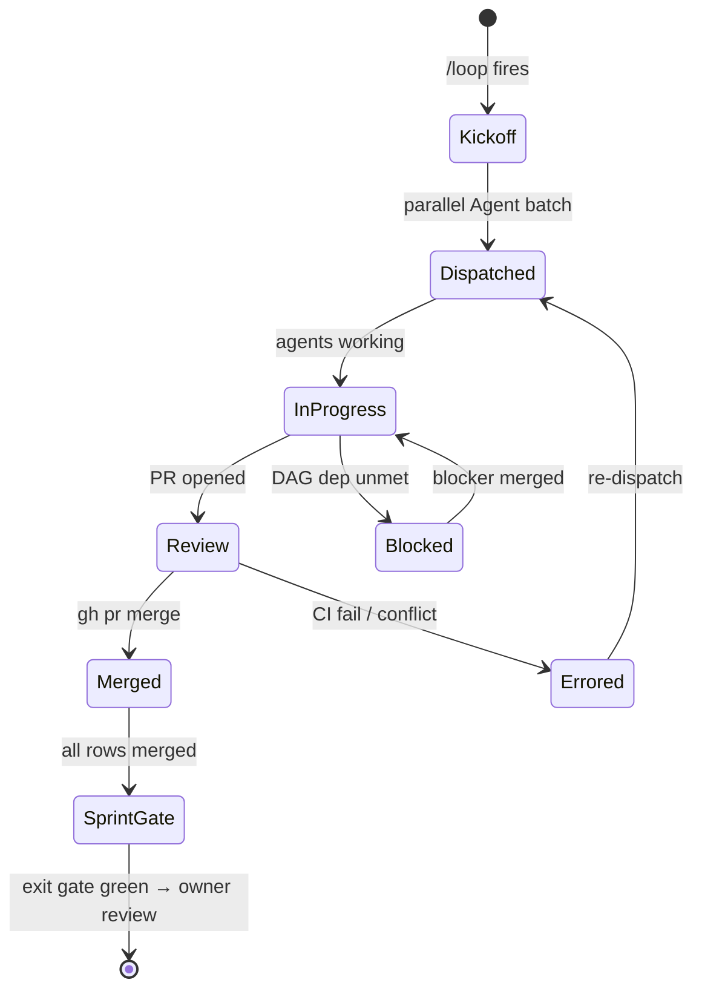

# Control One — PR #51 Closure Timeline

**Status:** delivery plan
**Date:** 2026-05-08
**Source PR:** [#51](https://github.com/CloudSpaceLab/control_one/pull/51)
**Companion docs:** [`gaps-vs-probo-holmesgpt.md`](./gaps-vs-probo-holmesgpt.md), [`incomplete-features-and-bugs.md`](./incomplete-features-and-bugs.md)
**Target tag:** v1.1.0-pilot
**Start date:** 2026-05-11
**Projected end:** 2026-08-21

PR #51 shipped two strategic docs anchored to the owner's three-pillar lens but no delivery plan: no calendar, no worktree breakdown, no dependency graph, no projected tag. This document is the plan. Scope: full **P0 + P1 + P2 + P3** (~13 working weeks), modeled as parallel worktrees per sprint, executed via a `/loop`-driven coordinator that dispatches per-worktree subagents across **three Claude tiers (Opus 4.7 / Sonnet 4.6 / Haiku 4.5) and three frontier providers (Anthropic, OpenAI, Google)** behind a unified Go router introduced in Sprint 5.

Predecessor work (Sprints 0–3, v1.0.0) is closed. This is **Sprint 4 onward**.

---

## 0. The lens (carried from the gap doc)

> "In a bank, daily ops are mostly boring. Only three things ever change — **traffic surge, incoming attacks, server health depreciation**. When investigation is needed, give complete detail to any depth via a chat-first interface. UI refactor is separate."

Every worktree below carries a pillar tag (🚦 / 🛡️ / 💚 / 🔬 / 🏛️) so the plan stays anchored to the lens, not to a feature taxonomy.

---

## 1. 3-Pillar status (post-Sprint-3)

### 🚦 Surge

| ✅ Shipped | ❌ Remaining |
|---|---|
| `telemetry_metrics_1m` + `unique_counters` collected | No surge-specific detector (z-score on rolling 1m/5m/1h windows) |
| | No Prometheus / Alertmanager ingest |

### 🛡️ Attacks

| ✅ Shipped | ❌ Remaining |
|---|---|
| 7 inline behavioral detectors | Zero CVE / KEV / NVD / OSV references |
| 7 TI feeds + correlation engine | Trivy adapter discards CVE detail |
| Auto-block firewall fan-out | Findings overlay (Probo cherry-pick) |
| | AML auth gap (P0 security) |
| | Sanctions HTTPS + DOB fallback (P0 security) |

### 💚 Health

| ✅ Shipped | ❌ Remaining |
|---|---|
| Heartbeat + disk + node_repair | "Calibrating (0/24)" stuck — agent emits 9 names, predictive engine reads 7 disjoint names |
| `node_health_scores` table | No SMART / PSI / HSM collectors |
| | No predictive trend regression |

### 🔬 Investigation

| ✅ Shipped | ❌ Remaining |
|---|---|
| 10+ REST investigation endpoints | Single-shot LLM at `controlplane/internal/server/ai_ask.go:256` — no `tool_use` loop |
| Hand-rolled markdown KG | KG ~15% of what its intro claims (no firewall, alerts, health, baselines, Doris reads) |
| | OpenReplay session recording is a no-op stub |

---

## 2. Sprint plan — parallel worktrees

| Sprint | Tier | Wall time | Worktrees | Goal |
|---|---|---|---:|---|
| **Sprint 4** | P0 | ~2 wks | 13 | Block-any-pilot-demo: security + 3 single-node bugs + patch gate + KG-A + UX nav |
| **Sprint 5** | P1 | ~3 wks | 11 | Pilot-signoff: LLM router + MCP/tool_use chain + CVE/KEV + agent reliability + critical test coverage |
| **Sprint 6** | P2 | ~2 wks | 10 | Hardening: KG tool-shaped + Probo cherry-picks + scalability + evidence backend |
| **Sprint 7** | P3 | ~1 wk | 6 | Cleanup: telemetry rough edges + shim removal + production runbook |

**40 worktrees total. Projected v1.1.0-pilot tag: 2026-08-21.**

---

## 3. Loop workflow shape

Each sprint runs as one `/loop` cycle (dynamic pacing). Owner approves the sprint exit gate before the next sprint kicks off — oversight at sprint boundaries, throughput inside the sprint.



**Pacing rules:**
- Active sprint with running PRs: 1500–1800 s ticks (~25–30 min) — stays inside the Anthropic prompt-cache TTL.
- DAG-bottleneck wait (e.g. S5 day-1 MCP wrapper unblocks day-2 tool_use loop): drop to 600–900 s.
- Mid-sprint stall (no PR motion >2 ticks): bump to 3000 s and surface a status note; don't burn cycles polling.

**Status values** in worktree tables below match Mermaid state names verbatim: `dispatched / in-progress / review / merged / blocked / errored`.

The loop coordinator is the main session; subagents do not nest loops. State lives in this document — no separate state file. Each tick the loop reads `gh pr list`, updates status columns, re-dispatches errored agents, dispatches unblocked agents.

### Model dispatch policy

The loop dispatches each worktree to a Claude variant matched to its complexity, not a single default. Three tiers across the available models (Opus 4.7, Sonnet 4.6, Haiku 4.5):

| Tier | Model | When to pick | Cost/latency profile |
|---|---|---|---|
| **L1 — Trivial** | Haiku 4.5 | ≤1 d effort, single-file edit, no architecture decisions, no cross-cutting contracts (e.g. plain text → button, env-var swap, dead-handler delete, JSONB read-through) | Cheapest, fastest. Burns cycles only on what mechanical fixes need. |
| **L2 — Standard** | Sonnet 4.6 | 1–3 d effort, multi-file but bounded scope, follows an existing pattern in the repo (e.g. add a new endpoint matching siblings, a new tab on an existing page, refactor with clear analogue) | Default tier. Most worktrees land here. |
| **L3 — Architectural** | Opus 4.7 | New control flow, agent↔server contract change, security-critical correctness, code with no analogue in the repo (e.g. MCP wrapper, `tool_use` loop in `ai_ask.go`, KG tool-shaped rewrite, calibration metric-name contract spanning agent + predictive engine, CVE/KEV pipeline) | Highest cost, deepest reasoning. Reserved for the rows where wrong-shape changes block the next sprint. |

**Tier appears in every worktree table below as the `Model` column.** Tier counts across the 40 worktrees: **L1 Haiku ×14, L2 Sonnet ×19, L3 Opus ×7**. Owner can override any row before kickoff (e.g. promote a borderline L2 to L3 if the operator-mode trigger is fragile).

**Re-dispatch escalation (two axes):**
- *Tier promotion:* if an L1/L2 row errors twice on CI/lint or hits a structural review comment, the loop promotes one tier on next dispatch. `c1-aml-auth-fix` errored as L1 → next tick redispatch as L2.
- *Provider fallback:* if the primary provider returns 5xx or the agent errors twice, the loop reroutes to the secondary provider (see fallback chain in Multi-provider routing below). Both axes can fire on the same row; tier promotion happens within a provider, fallback happens across providers.

### Multi-provider routing

The dispatch policy spans **three Claude variants AND three frontier providers**, not just Anthropic. Sprint 5 introduces a thin LLM router (`c1-llm-router`, see §5) that wraps three SDKs behind one Go interface; the loop selects provider per-worktree based on the model's known strengths.

**Library pick-list (Go server side):**

```
github.com/anthropics/anthropic-sdk-go    # Claude — default; Opus/Sonnet/Haiku
github.com/openai/openai-go               # GPT family — test-gen, prose, structured extraction
google.golang.org/genai                   # Gemini family — long-context wins
```

**Why three providers, not one:**
1. **Diversity of strengths** — GPT-5 family is stronger at test generation and prose; Gemini 2.5 has 2M-token context that absorbs full KEV/CVE catalogs in one pass.
2. **Redundancy** — an Anthropic API outage on a kickoff morning shouldn't pause the entire sprint; the loop falls back across providers.
3. **Cost shape** — long-context jobs are cheaper on Gemini Flash than Opus 4.7 even at the same quality bar.
4. **Independent benchmarking** — a row that fails twice on one provider auto-redispatches on a second before owner escalation.

**Per-worktree provider overrides** (default is Anthropic; rows below override):

| Worktree | Sprint | Provider + Model | Why |
|---|---|---|---|
| `c1-cve-kev-osv` | S5 | **Google Gemini 2.5 Pro** | Scans full CISA KEV catalog + OSV database + `node_packages`; long-context dominates here |
| `c1-critical-test-coverage` | S5 | **OpenAI GPT-5** | Test generation across 4 untested Go modules — GPT-5 family's strongest documented modality |
| `c1-process-tree-hydrate` | S5 | **OpenAI GPT-5** | Algorithmic recursion over `process_lineage`; well-trodden GPT-5 territory |
| `c1-trivy-cve-detail` | S5 | **OpenAI GPT-5** | Parser/adapter work — structured-data extraction from Trivy JSON output |
| `c1-dashboard-scalability` | S6 | **Google Gemini 2.5 Pro** | Holds whole dashboard query tree + Doris MV definitions in context simultaneously |
| `c1-ingest-version-tolerance` | S6 | **Google Gemini 2.5 Flash** | Wire-format compatibility analysis across agent + controlplane versions |
| `c1-evidence-metadata-jsonb` | S6 | **OpenAI GPT-5-mini** | JSONB schema reconciliation — structured-data work, cost-shaped to mini |
| `c1-rollup-reconciliation` | S7 | **Google Gemini 2.5 Pro** | Cross-system reconciliation — Postgres `IncrementHourlyRollup` vs Doris `events_per_hour_mv` held in one context window |
| `c1-prod-runbook-wiki` | S7 | **OpenAI GPT-5** | Long-form prose writing for on-call audience |

All other 31 rows route to Anthropic per the L1/L2/L3 model column.

**Provider mix across 40 worktrees:** Anthropic ×31 (78%), OpenAI ×5 (12%), Google ×4 (10%).

**Fallback chain:** the router records `{worktree, primary, secondary, tertiary}` per row. If primary errors twice (CI/lint or 5xx from API), the next dispatch routes to secondary; if secondary errors, tertiary. Default chain for Anthropic-default rows is `Anthropic → OpenAI → Google`; Gemini-primary rows fall back `Google → Anthropic → OpenAI`. Owner is paged before the chain exhausts.

---

## 4. Sprint 4 — P0 (block any pilot demo)

**Goal:** ship the four P0 security fixes + three single-node view bugs + patch approval gate + KG minimal enrichment + compliance row→node nav. After S4 the production deployment at `control-one.cloudspacetechs.com` is demo-able.

### Tick table (planned; populated live by `/loop`)

| Tick | Wall time | Pacing | Action | Snapshot |
|---:|---|---|---|---|
| 0 | 2026-05-11 09:00 | — | Dispatch all 13 worktrees as one Agent batch | `13 dispatched / 0 merged` |
| 1 | +1800 s | 30 min | Read `gh pr list`; update worktree table | `13 in-progress / 0 merged` |
| 2 | +1800 s | 30 min | First small-fix PRs land (compliance-row-nav, sanctions-dob, sanctions-https) | `3 merged / 10 in-progress` |
| 3 | +1800 s | 30 min | AML auth + heartbeat-action-prefix + recommendations-bridge land | `6 merged / 7 in-progress` |
| … | … | … | (live) | … |
| N | exit | — | All 13 merged + integration test green + bugs §9 SQL recipes return expected results | `13 merged → SprintGate` |

### Worktrees

| Worktree | Branch | Pillar | Source | Effort | Model | PR | Status | Merge SHA |
|---|---|---|---|---|---|---|---|---|
| `c1-aml-auth-fix` | `fix/c1-s4-aml-auth` | 🛡️ | bugs §4 #1 | 4–6 h | L1 Haiku | — | pending | — |
| `c1-sanctions-https` | `fix/c1-s4-sanctions-https` | 🛡️ | bugs §4 #2 | 2–3 h | L1 Haiku | — | pending | — |
| `c1-sanctions-dob-refuse` | `fix/c1-s4-sanctions-dob` | 🛡️ | bugs §4 #3 | 2 h | L1 Haiku | — | pending | — |
| `c1-openreplay-decision` | `fix/c1-s4-openreplay` | 🏛️ | bugs §4 #4 | 1 h–1 d | L1 Haiku | — | pending | — |
| `c1-recommendations-bridge` | `fix/c1-s4-recos-bridge` | 💚 | bugs §1.3 | 1 d | L2 Sonnet | — | pending | — |
| `c1-calibration-metric-contract` | `fix/c1-s4-calibration` | 💚 | bugs §1.1 | 2–3 d | **L3 Opus** | — | pending | — |
| `c1-connections-doublefilter` | `fix/c1-s4-connections` | 💚 | bugs §1.2 | 1 d | L2 Sonnet | — | pending | — |
| `c1-patch-approval-gate` | `fix/c1-s4-patch-gate` | 🛡️ | bugs §3.1 | 4–6 h or 2–3 d | L2 Sonnet | — | pending | — |
| `c1-patch-node-selector` | `fix/c1-s4-patch-selector` | 🛡️ | bugs §3.3 #2 | 4–6 h | L2 Sonnet | — | pending | — |
| `c1-packages-on-node-tab` | `fix/c1-s4-packages-tab` | 🛡️ | bugs §3.3 #3 | 6–8 h | L2 Sonnet | — | pending | — |
| `c1-heartbeat-action-prefix` | `fix/c1-s4-hb-prefix` | 🛡️ | bugs §3.3 #5 | 2–3 h | L1 Haiku | — | pending | — |
| `c1-kg-minimal-enrichment` | `fix/c1-s4-kg-enrich` | 🔬 | bugs §2 option A | 2 d | **L3 Opus** | — | pending | — |
| `c1-compliance-row-nav` | `fix/c1-s4-compliance-nav` | 🔬 | bugs §1.5 | 30 min | L1 Haiku | — | pending | — |

**S4 tier mix:** L1 ×6 / L2 ×5 / L3 ×2. Calibration + KG-enrichment carry the Opus seats — both are cross-cutting (agent↔server contract / cache-invalidation graph) where wrong-shape merges block S5 and S6 respectively.

### Hard-gate DAG (intra-sprint)

```
c1-recommendations-bridge ─┐
c1-calibration-metric ─────┼─→ c1-kg-minimal-enrichment
                           │   (KG enrichment reads node_health_scores +
                           │    port_observations; both empty until these merge)
c1-patch-approval-gate ───────→ c1-patch-node-selector
                                (no point in better UI if every deploy is gate_blocked)
c1-aml-auth-fix ──────────────→ unblocks "demo to bank" (informational, not code)
```

All other rows are independent — parallel-safe.

### Per-worktree exit criteria

1. `cd controlplane && go test ./... -count=1 -short` green
2. `cd controlplane/ui && npm run lint && npm test` green
3. `golangci-lint run ./...` clean (or matches pre-existing baseline)
4. Migration up/down tested via testcontainers (only if migration touched)
5. One golden-path integration test for the feature
6. PR opened, CI green, links back to this document

### Sprint exit gate

- All 13 worktrees merged, sprint integration test green on production-like Doris+Postgres
- Bugs doc §9 diagnostic SQL recipes on production return expected results:
  - calibration: predictive metric names appear in `telemetry_metrics`
  - connections: `process_connections` rows visible with active flow filter
  - recommendations: `port_observations` row count > 0
- Owner ack received before S5 kickoff

---

## 5. Sprint 5 — P1 (before pilot signoff)

**Goal:** the 5-day MCP/`tool_use` chain (gap doc §6) + CVE/KEV enrichment + agent reliability + process-tree hydration + critical test coverage. After S5, investigation parity with HolmesGPT for relevant scope is real, not aspirational.

### Tick table (planned)

| Tick | Wall time | Pacing | Action | Snapshot |
|---:|---|---|---|---|
| 0 | 2026-05-25 09:00 | — | Dispatch 5 parallel non-MCP worktrees + open MCP day-1 sub-agent | `6 dispatched / 0 merged` |
| 1 | +1800 s | 30 min | MCP day-1 (`c1-mcp-wrapper`) PR opens | `6 in-progress` |
| 2 | +900 s | 15 min (DAG watch) | MCP day-1 merges → dispatch `c1-tooluse-loop` | `1 merged / 6 in-progress` |
| 3..7 | per day | 30 min cadence between MCP days | Day-2 → day-3 → day-4 → day-5 chain merges sequentially | (chain) |
| … | … | … | CVE/KEV + agent-fatal + process-tree + tests land in parallel | … |
| N | exit | — | All 10 merged + Operator-mode auto-investigates a real anomaly emit | `10 merged → SprintGate` |

### Worktrees

| Worktree | Branch | Pillar | Source | Effort | Model | PR | Status | Merge SHA |
|---|---|---|---|---|---|---|---|---|
| `c1-llm-router` | `feat/c1-s5-llm-router` | 🔬 | new (multi-provider) | 1 d | **L3 Opus** | — | pending | — |
| `c1-mcp-wrapper` | `feat/c1-s5-mcp-wrapper` | 🔬 | gap §6 day 1 | 1 d | **L3 Opus** | — | pending | — |
| `c1-tooluse-loop` | `feat/c1-s5-tooluse-loop` | 🔬 | gap §6 day 2 | 1 d | **L3 Opus** | — | pending | — |
| `c1-streaming-citations` | `feat/c1-s5-stream-cite` | 🔬 | gap §6 day 3 | 1 d | L2 Sonnet | — | pending | — |
| `c1-tool-rbac` | `feat/c1-s5-tool-rbac` | 🔬 | gap §6 day 4 | 1 d | L2 Sonnet | — | pending | — |
| `c1-operator-mode` | `feat/c1-s5-operator-mode` | 🛡️🚦💚 | gap §6 day 5 | 1 d | L2 Sonnet | — | pending | — |
| `c1-cve-kev-osv` | `feat/c1-s5-cve-kev` | 🛡️ | gap §5 Attacks | ~13 d | **L3 Opus** | — | pending | — |
| `c1-agent-fatal-cleanup` | `fix/c1-s5-agent-fatal` | 💚 | bugs §5 #5 | 3 d | L2 Sonnet | — | pending | — |
| `c1-process-tree-hydrate` | `fix/c1-s5-process-tree` | 🔬 | bugs §5 #6 | 2 d | L2 Sonnet | — | pending | — |
| `c1-critical-test-coverage` | `test/c1-s5-coverage` | 🏛️ | bugs §5 #9 | 4 d | L2 Sonnet | — | pending | — |
| `c1-trivy-cve-detail` | `fix/c1-s5-trivy-detail` | 🛡️ | bugs §5 #10 | 1 d | L1 Haiku | — | pending | — |

**S5 tier mix:** L1 ×1 / L2 ×6 / L3 ×4. Four Opus seats reserved for genuinely architectural work: the LLM router (new Go package abstracting Anthropic + OpenAI + Google SDKs), MCP wrapper (new Go package + transport choice), the `tool_use` loop refactor in `ai_ask.go` (new control flow with stop-reason parsing), and the CVE/KEV/OSV pipeline (new feed integration with KEV+EPSS prioritization, Gemini-primary). Day-3..day-5 of the MCP chain are mechanical extensions of the day-1/day-2 architecture, hence Sonnet.

**S5 worktree count: 11** (was 10 before adding `c1-llm-router`).

### Hard-gate DAG (intra-sprint)

```
c1-llm-router → c1-mcp-wrapper → c1-tooluse-loop → c1-streaming-citations
                                                 → c1-tool-rbac
                                                 → c1-operator-mode
                                                 (strict day-0..day-5 chain;
                                                  one agent drives this branch
                                                  sequentially)

c1-cve-kev-osv  ⊥  the MCP chain  (independent, runs in parallel for ~13 d
                                  on Google Gemini 2.5 Pro)

c1-calibration-metric (S4) ──→ c1-operator-mode
                                (operator-mode triggers on anomaly emits;
                                 needs real signals from S4 calibration fix)
```

`c1-llm-router` is the day-0 prerequisite: all subsequent S5/S6 LLM-touching code calls through `controlplane/internal/llm/router.go` rather than `anthropic-sdk-go` directly. Non-MCP, non-router rows all parallel-safe.

### Per-worktree exit criteria

Same six rules as S4. Additional:
- `c1-llm-router`: the same `ai_ask.go` question routes successfully through Anthropic, OpenAI, and Google providers in three smoke-test invocations; fallback chain triggers on simulated 5xx
- MCP chain rows: each day's tool surface is callable from `curl /ai/ask` with at least one demonstrable tool_use round-trip
- `c1-operator-mode`: an injected anomaly emit results in an `investigations` table row within 60 s
- `c1-cve-kev-osv`: at least one `node_packages` row gets a CVE/KEV stamp end-to-end (via Gemini 2.5 Pro long-context scan)

### Sprint exit gate

- All 10 worktrees merged
- Architectural test from gap doc §6: `curl /ai/ask` with a complex investigation question completes via multi-tool loop, citations resolve, no fabrications
- Operator-mode catches a real production anomaly emit and writes a verdict
- Test coverage on 4 critical untested modules (`ai_ask`, `compliance_evidence`, `dlp_scan`, `anomaly_baselines`) is non-zero

---

## 6. Sprint 6 — P2 (hardening)

**Goal:** swap KG-A for KG-B (tool-shaped), land Probo cherry-picks (Findings + Snapshots + Asset criticality), fix dashboard scalability, move evidence to S3, kill ingest version-bump landmines.

### Tick table (planned)

| Tick | Wall time | Pacing | Action | Snapshot |
|---:|---|---|---|---|
| 0 | 2026-06-22 09:00 | — | Dispatch all 10 worktrees as one Agent batch | `10 dispatched / 0 merged` |
| 1..N | +1800 s | 30 min | (live) | … |
| N | exit | — | All 10 merged + KG-B replaces KG-A in `ai_ask.go` | `10 merged → SprintGate` |

### Worktrees

| Worktree | Branch | Pillar | Source | Effort | Model | PR | Status | Merge SHA |
|---|---|---|---|---|---|---|---|---|
| `c1-kg-tool-shaped` | `feat/c1-s6-kg-tools` | 🔬 | bugs §2 option B | 1 wk | **L3 Opus** | — | pending | — |
| `c1-dashboard-scalability` | `fix/c1-s6-dash-scale` | 🚦 | bugs §5 #8 | 2 d | L2 Sonnet | — | pending | — |
| `c1-vendor-update-endpoint` | `feat/c1-s6-vendor-update` | 🏛️ | bugs §5 #11 | 1 d | L1 Haiku | — | pending | — |
| `c1-evidence-s3-backend` | `feat/c1-s6-evidence-s3` | 🏛️ | bugs §5 #12 | 2 d | L2 Sonnet | — | pending | — |
| `c1-evidence-metadata-jsonb` | `fix/c1-s6-evidence-meta` | 🏛️ | bugs §5 #13 | 1 d | L1 Haiku | — | pending | — |
| `c1-dead-handler-cleanup` | `chore/c1-s6-dead-handlers` | 🏛️ | bugs §6 #15–16 | 0.5 d | L1 Haiku | — | pending | — |
| `c1-ingest-version-tolerance` | `fix/c1-s6-ingest-version` | 🏛️ | bugs §6 #17 | 1 d | L2 Sonnet | — | pending | — |
| `c1-snapshots-overlay` | `feat/c1-s6-snapshots` | 🔬 | gap §3 Probo | 2 d | L2 Sonnet | — | pending | — |
| `c1-asset-criticality-overlay` | `feat/c1-s6-asset-crit` | 💚 | gap §3 Probo | 1 d | L2 Sonnet | — | pending | — |
| `c1-findings-overlay` | `feat/c1-s6-findings` | 🛡️ | gap §3 Probo | 2 d | L2 Sonnet | — | pending | — |

**S6 tier mix:** L1 ×3 / L2 ×6 / L3 ×1. KG tool-shaped is the lone Opus seat — it deletes the KG-A code path and rewires `ai_ask.go` to compose tool calls instead of stuffing a markdown blob into the system prompt. The Probo cherry-picks (snapshots / asset criticality / findings) are pattern-matches against existing entity overlays in the repo, hence Sonnet.

### Hard-gate DAG (cross-sprint)

```
c1-tooluse-loop (S5) ──→ c1-kg-tool-shaped (S6)
                          (KG-B is a thin tool over the loop;
                           cannot ship without S5 chain)

c1-kg-minimal-enrichment (S4) ──→ c1-kg-tool-shaped (S6)
                                   (option B replaces option A;
                                    delete A's code path on merge)
```

All other S6 rows are independent.

### Sprint exit gate

- All 10 worktrees merged
- KG-A code path deleted (no dead branches in `ai_ask.go`)
- One bank-pilot evidence file written and read back through S3 backend
- Vendor UPDATE endpoint exercised by a real tenant config
- Dashboard P95 latency on a 100-node test fleet acceptable (target: TBD by owner before kickoff)

---

## 7. Sprint 7 — P3 (cleanup)

**Goal:** retire telemetry rough edges, drop the test-hooks shim, write a production runbook the on-call rotation can actually use.

### Tick table (planned)

| Tick | Wall time | Pacing | Action | Snapshot |
|---:|---|---|---|---|
| 0 | 2026-07-13 09:00 | — | Dispatch all 6 worktrees in parallel | `6 dispatched / 0 merged` |
| 1..N | +1800 s | 30 min | (live) | … |
| N | exit | — | All 6 merged | `6 merged → SprintGate` |

### Worktrees

| Worktree | Branch | Pillar | Source | Effort | Model | PR | Status | Merge SHA |
|---|---|---|---|---|---|---|---|---|
| `c1-telemetry-bytes-bump` | `fix/c1-s7-telemetry-bytes` | 💚 | bugs §6 #18 | 2 h | L1 Haiku | — | pending | — |
| `c1-rollup-reconciliation` | `fix/c1-s7-rollup-recon` | 💚 | bugs §6 #19 | 2 d | L2 Sonnet | — | pending | — |
| `c1-penalty-tiebreak-fix` | `fix/c1-s7-tiebreak` | 💚 | bugs §6 #20 | 4 h | L1 Haiku | — | pending | — |
| `c1-predictive-window-tune` | `fix/c1-s7-pred-window` | 💚 | bugs §6 #21 | 4 h | L1 Haiku | — | pending | — |
| `c1-test-hooks-shim-remove` | `chore/c1-s7-shim-remove` | 🏛️ | bugs §5 #14 | 1 h | L1 Haiku | — | pending | — |
| `c1-prod-runbook-wiki` | `docs/c1-s7-runbook` | 🔬 | bugs §7 | 1 d | L2 Sonnet | — | pending | — |

**S7 tier mix:** L1 ×4 / L2 ×2 / L3 ×0. P3 cleanup is the cheapest sprint — almost all Haiku. Rollup reconciliation gets Sonnet because the divergence-bomb risk (Postgres `IncrementHourlyRollup` vs Doris `events_per_hour_mv`) needs careful equivalence checking, not mechanical transposition.

All P3 rows independent — single parallel batch, no DAG within sprint.

### Sprint exit gate

- All 6 worktrees merged
- Production runbook exists with topology, broken-area inventory (now empty post-S4), diagnostic recipes (bugs §9 SQL)
- v1.1.0-pilot tag pushed from `main`

---

## 8. Cross-sprint dependency graph

```
   ┌──────────── Sprint 4 (P0) ────────────┐
   │ recommendations-bridge ──┐            │
   │ calibration-metric ──────┼─→ kg-minimal-enrichment
   │ patch-approval-gate ─────┴─→ patch-node-selector
   │ + 9 independent rows                  │
   └────────┬───────────────────────────────┘
            │
            └─ calibration-metric ──────────┐
                                            ▼
   ┌──────────── Sprint 5 (P1) ─────────────────┐
   │ mcp-wrapper → tooluse-loop → streaming     │
   │                            → tool-rbac     │
   │                            → operator-mode │
   │ cve-kev-osv (parallel, ~13d)               │
   │ + 4 independent rows                       │
   └────────┬───────────────────────────────────┘
            │
            └─ tooluse-loop ──┐
                              ▼
   ┌──────────── Sprint 6 (P2) ────────────┐
   │ kg-tool-shaped (replaces kg-minimal)  │
   │ + 9 independent rows                  │
   └────────┬──────────────────────────────┘
            │
            ▼
   ┌──────────── Sprint 7 (P3) ────────────┐
   │ 6 fully independent rows              │
   └────────────────────────────────────────┘
            │
            ▼
       v1.1.0-pilot tag
```

---

## 9. Calendar math

- **Start:** 2026-05-11 (Mon following PR #51 merge; 2026-05-08 was Fri)
- **Working day model:** 5 days/week. Nigerian Democracy Day **2026-06-12 (Fri)** subtracted from S5
- **Sum of effort:** ~13 working weeks = 65 working days. + 1 integration day per sprint (×4) + 5 buffer days = **74 working days**
- **Projected sprint ends:**
  - S4 ends **2026-05-22 (Fri)** — 10 working days
  - S5 ends **2026-06-19 (Fri)** — 19 working days (S5 length 14 + holiday + integration)
  - S6 ends **2026-07-10 (Fri)** — 14 working days
  - S7 ends **2026-07-24 (Fri)** — 9 working days
  - Integration + buffer → **2026-08-21 (Fri)**
- **Projected v1.1.0-pilot tag: 2026-08-21**

These dates are nominal until owner confirms; will be locked at S4 kickoff.

---

## 10. Decisions deferred to owner

These are flagged here, not silently chosen. Owner ack required before S4 kickoff.

1. **`c1-patch-approval-gate` — quick vs proper** (4–6 h flag flip vs 2–3 d real approve→dispatch loop). Bugs doc §3.1 presents both. Plan assumes proper loop; if quick wins, S4 shrinks by ~2 d.
2. **`c1-openreplay-decision`** — implement OpenReplay upload (compliance feature) vs remove flag + document (operational honesty). Default: remove + document; revisit when a paying bank asks.
3. **Sprint 7 inclusion** — P3 is "as-asked" in the source docs. Plan includes it for completeness; owner may push S7 to backlog and tag v1.1.0-pilot at end of S6.

---

## 11. Risk register

| # | Risk | Likelihood | Impact | Mitigation |
|---|---|---|---|---|
| R1 | Doris cluster instability during `c1-connections-doublefilter` testing | M | Sprint slip 2–3 d | Set up Doris dev replica before S4 kickoff |
| R2 | Anthropic SDK churn breaking the MCP chain mid-S5 | L | Sprint slip 1 wk | Pin SDK version at S5 kickoff; defer SDK upgrade to post-pilot |
| R3 | Agent rollout reveals untested OS combos for new collectors (PSI, SMART, ICMP) | M | Sprint slip 2–3 d in S4 | macOS/Windows fail-safe to omit signal; Linux-first deploy |
| R4 | `c1-cve-kev-osv` blocks on missing test fixtures (no offline KEV mirror) | M | S5 slip 3–5 d | Mirror CISA KEV catalog locally at S5 kickoff |
| R5 | Owner unavailable for S5/S6/S7 sprint-boundary review (creates idle time) | M | Wall-clock slip per gap | Confirm review windows before S4 kickoff; pre-authorize S6 cleanup-only rows |

---

## 12. Verification (per sprint)

1. All worktree exit criteria green (tests, lint, migration, integration test)
2. Bugs doc §9 diagnostic SQL recipes return expected results on production
3. Integration test on production-like Doris+Postgres stack
4. Worktree status table fully populated (no `pending` rows)
5. Owner ack on the sprint result table before next sprint kicks off

---

## Appendix — file pointers (referenced by worktrees)

| Worktree | Primary files |
|---|---|
| `c1-aml-auth-fix` | AML route handlers (search `s.authorize` gap) |
| `c1-sanctions-https` | Sanctions/Moov client (search `178.79.176.19/moov-watchman-aml`) |
| `c1-sanctions-dob-refuse` | `SanctionsScanner` (search `birthDate=1962-11-23`) |
| `c1-openreplay-decision` | `uploadToOpenReplay()` |
| `c1-recommendations-bridge` | `controlplane/internal/server/recommendations.go:33-108`, `correlation.go:229-242`, `knowledge_graph.go:94-159` |
| `c1-calibration-metric-contract` | `controlplane/internal/server/node_predictive.go:63-110, 494-539` + `internal/util/sysinfo.go:53-85` |
| `c1-connections-doublefilter` | `controlplane/internal/server/connections_query.go:23-67`, `controlplane/internal/doris/reader_events.go:78-118`, `controlplane/ui/src/pages/NodeDetail.tsx:484-640` |
| `c1-patch-approval-gate` | `controlplane/internal/server/patch.go:341` + `tenant_remediation_config.go:47` |
| `c1-patch-node-selector` | `controlplane/ui/src/pages/PatchManagement.tsx` |
| `c1-packages-on-node-tab` | `node_packages` storage + new endpoint + `NodeDetail.tsx` tab |
| `c1-heartbeat-action-prefix` | `controlplane/internal/server/heartbeat.go:259` |
| `c1-kg-minimal-enrichment` | `controlplane/internal/server/knowledge_graph.go:235-323` |
| `c1-compliance-row-nav` | `controlplane/ui/src/pages/Compliance.tsx:263-270` |
| `c1-llm-router` | new package `controlplane/internal/llm/router.go` wrapping `anthropic-sdk-go` + `openai-go` + `genai`; provider fallback chain + per-row override registry |
| `c1-mcp-wrapper` → `c1-operator-mode` | `controlplane/internal/server/ai_ask.go:256`, `investigate.go:79, 738`, `events_anomaly.go:22-300` (all calls go through `internal/llm/router` not `anthropic-sdk-go` directly) |
| `c1-cve-kev-osv` | `node_packages` + new CVE feed worker |
| `c1-agent-fatal-cleanup` | `cmd/nodeagent/` (15+ `panic`/`log.Fatal`) |
| `c1-process-tree-hydrate` | process-tree handler (stub) |
| `c1-trivy-cve-detail` | Trivy adapter (currently aggregates only) |
| `c1-kg-tool-shaped` | replaces `knowledge_graph.go` blob with tool-call surface |
| `c1-rollup-reconciliation` | Postgres `IncrementHourlyRollup` + Doris `events_per_hour_mv` (`events_ingest.go:389-394`) |
| `c1-penalty-tiebreak-fix` | `node_predictive.go:635-650` |
| `c1-predictive-window-tune` | `node_predictive.go:495-500` |
